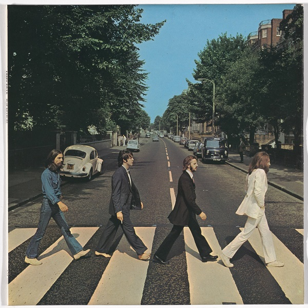

# Live-Album-Cover
## The main idea 
When we listen to a music album, we cannot avoid watching and examining its cover.
Unfortunately, listening through the album, switching from song to song, the cover is static and doesn’t add any more information or artistic novelty to the audience experience. From this fact, we developed the idea to take the album cover and bring it alive, making it change with the music, following in real time some feature extracted from the song itself.  
The image will be segmented using AI algorithms, and deconstructed in a moving particle system, in which colours, velocity, brightness, ecc. reflect changes in music.
With help of audio segmentation, these visual effects will follow the mood of every single song. 
For the implementation, we will use Python for feature extraction and Image Semantic Segmentation, Processing will manage the graphical part.

# How to use Live Album Cover 
## Structure 
The code is divided in:
* Python 
  * Image Semantic Segmentation
  * Feature extraction
* Processing
  * Visual effects

## Image semantic segmentation
Fist thing to do is the segmentation of the cover image. In order to do that you need to insert the choosen cover in the ***data*** folder, than you simply insert the name of the file in the ***Imgae_semantic_segm.py*** file:  
~~~python
################## insert here the name of the cover you want to segment #############
song_name = "muse"
######################################################################################
~~~
The segmentation is based on three pretrained model to choose from:
~~~python
model = pspnet_50_ADE_20K() # load the pretrained model trained on ADE20k dataset

model1 = pspnet_101_cityscapes() # load the pretrained model trained on Cityscapes dataset

model2 = pspnet_101_voc12() # load the pretrained model trained on Pascal VOC 2012 dataset
~~~ 
These models deal with the segmentation, the results will be not so accurate as it would be necessary to train the network with an album cover dataset. 
Here there are two examples: 

 

 

 

